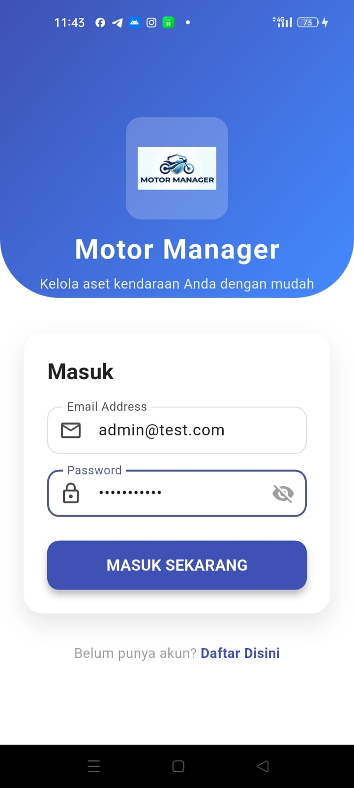
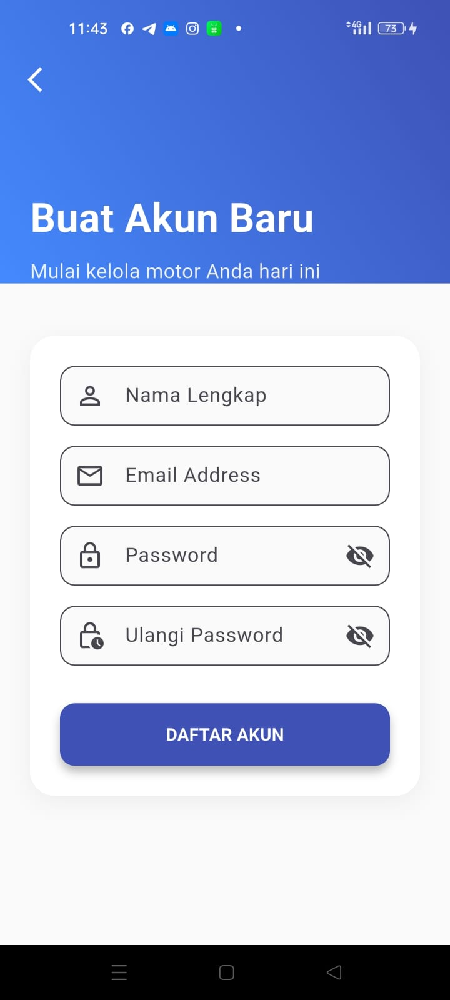
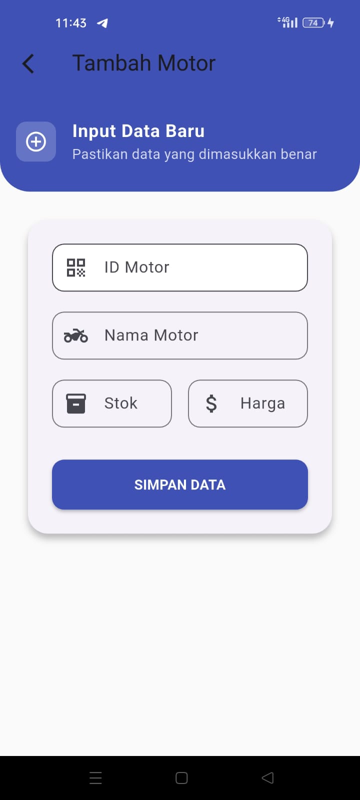

# 🏍️ Motor Manager App

Aplikasi Manajemen Motor berbasis Mobile (Flutter) dan Web API (Laravel). Aplikasi ini memungkinkan pengguna untuk memantau stok, mengelola harga, serta menambah, mengedit, dan menghapus data motor secara *real-time*.

## 📱 Tampilan Aplikasi (Screenshots)

Berikut adalah antarmuka aplikasi Motor Manager:

| Login Page | Register Page |
|:----------:|:-------------:|
|  |  |
| **Login yang Aman** | **Registrasi Pengguna Baru** |

| Dashboard List | Input & Edit Form |
|:--------------:|:-----------------:|
|  |  |
| **Daftar Motor & Stok** | **Form Tambah/Edit Data** |

---

## 🛠️ Teknologi yang Digunakan

* **Frontend:** Flutter (Dart)
* **Backend:** Laravel 10/11 (PHP)
* **Database:** MySQL / MariaDB
* **Authentication:** Laravel Sanctum (Bearer Token)

---

## 🚀 Panduan Instalasi & Menjalankan (Step-by-Step)

Agar aplikasi dapat berjalan lancar antara HP Android dan Laptop/Server, ikuti langkah berikut dengan teliti.

### Bagian 1: Persiapan Backend (Laravel)

1.  **Clone/Masuk ke Folder Backend:**
    Pastikan Anda berada di direktori project Laravel.

2.  **Install Dependencies:**
    ```bash
    composer install
    ```

3.  **Konfigurasi Database:**
    * Buat database baru di phpMyAdmin (misal: `db_motor`).
    * Copy file `.env.example` menjadi `.env`.
    * Edit `.env` sesuaikan dengan database Anda:
        ```env
        DB_CONNECTION=mysql
        DB_HOST=127.0.0.1
        DB_PORT=3306
        DB_DATABASE=db_motor
        DB_USERNAME=root
        DB_PASSWORD=
        ```

4.  **Migrasi Database:**
    ```bash
    php artisan migrate
    ```

5.  **Jalankan Server (PENTING!):**
    Agar bisa diakses oleh HP Android, jangan gunakan `php artisan serve` biasa. Gunakan perintah ini agar server terbuka untuk jaringan lokal:
    ```bash
    php artisan serve --host=0.0.0.0 --port=8000
    ```

---

### Bagian 2: Persiapan Frontend (Flutter)

1.  **Cek IP Address Laptop:**
    Karena HP dan Laptop terpisah, Flutter perlu tahu alamat IP Laptop.
    * **Windows:** Buka CMD ketik `ipconfig`
    * **Linux/Mac:** Buka Terminal ketik `ip addr show` atau `ifconfig`
    * *Contoh IP:* `192.168.1.10` atau `10.92.x.x`

2.  **Konfigurasi API Service:**
    Buka file `lib/services/api_service.dart`. Ubah `baseUrl` sesuai IP Laptop Anda.

    ```dart
    class ApiService {
      // GANTI DENGAN IP LAPTOP ANDA
      static const String baseUrl = '[http://192.168.1.](http://192.168.1.)X:8000/api';
      ...
    }
    ```

3.  **Install Dependencies:**
    ```bash
    flutter pub get
    ```

4.  **Jalankan Aplikasi:**
    Pastikan HP terhubung via USB (Debugging On) atau gunakan Emulator.
    ```bash
    flutter run
    ```

---

## ⚠️ Troubleshooting (Kendala Umum)

**1. Aplikasi di HP tidak bisa Login / Loading Terus?**
* Pastikan Laptop dan HP terhubung ke **WiFi yang sama**.
* Pastikan Laravel berjalan dengan `--host=0.0.0.0`.
* **Firewall:** Jika menggunakan Windows/Linux, pastikan Port 8000 diizinkan.
    * *Linux (UFW):* `sudo ufw allow 8000/tcp`

**2. Error "Cleartext Traffic not permitted"?**
* Android memblokir koneksi HTTP (non-HTTPS) secara default. Pastikan di `android/app/src/main/AndroidManifest.xml` sudah ada:
    ```xml
    <application
        ...
        android:usesCleartextTraffic="true">
    ```

**3. Tampilan Overflow (Garis Kuning Hitam)?**
* Masalah ini terjadi jika nama motor terlalu panjang atau layar HP sempit. Solusinya sudah diterapkan menggunakan widget `Wrap` pada badge harga dan stok.

---

Made with ❤️ by ZechtXD